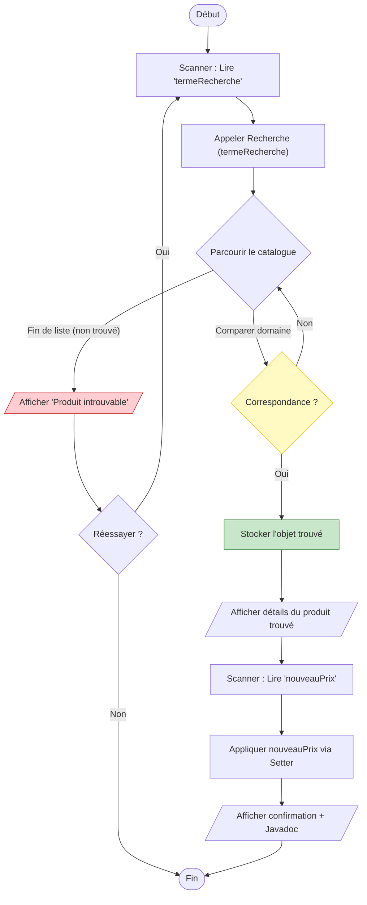
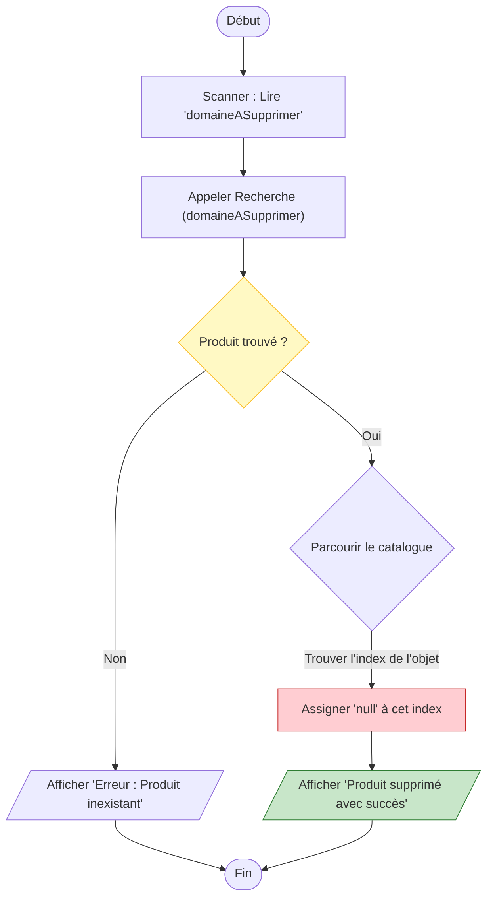
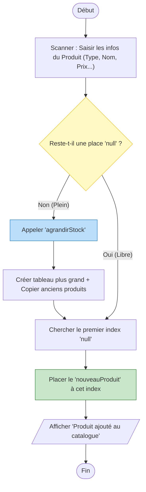
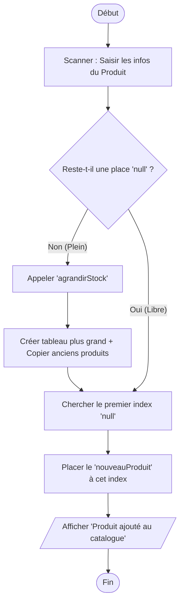
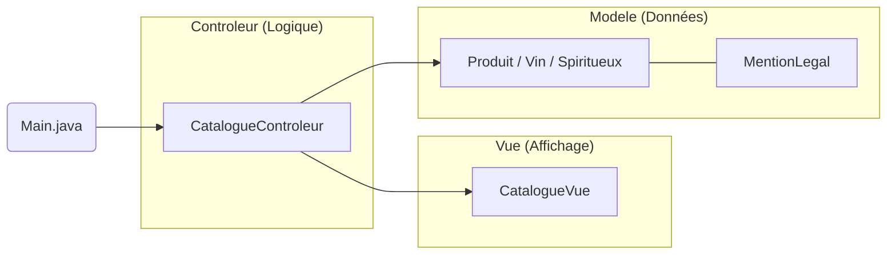

# 🍷 Gestion de Stock - Cave à Vins et Spiritueux

## Description
Ce projet est une application Java permettant de gérer un inventaire de bouteilles. Il met en œuvre les principes de la **Programmation Orientée Objet (POO)**.

## Fonctionnalités
* Affichage complet du catalogue.
* Recherche par nom de domaine.
* Mise à jour dynamique des prix.
* Suppression de références.
* Ajout de nouveaux produits avec extension automatique du stock.

## Algorithme

1. Exercice 1

````mermaid
graph TD
    %% 1. Initialisation
    Start([Début]) --> A["Initialiser 'listeProduits' (vide)"]
    A --> B["Définir Classe 'Produit' (Nom + Prix)"]
    
    %% 2. Ajout des données
    B --> C["Ajouter instances de Produit à la liste"]
    
    %% 3. Boucle de parcours
    C --> Loop{Pour chaque produit p}
    Loop -- "Parcourir" --> Format["Préparer affichage : Nom -- Prix €"]
    Format --> Loop
    
    %% 4. Affichage final
    Loop -- "Fin de liste" --> Display[/Afficher la liste complète/]
    
    %% 5. Tri
    Display --> Choice{Choisir le tri}
    Choice -- "Par Nom" --> SortN["Trier par Nom (A-Z)"]
    Choice -- "Par Prix" --> SortP["Trier par Prix (Croissant)"]
    
    SortN --> Final[/Afficher résultat trié/]
    SortP --> Final
    
    Final --> End([Fin])

    %% Couleurs pour différencier les étapes
    style Loop fill:#f9f,stroke:#333
    style Choice fill:#b3e5fc,stroke:#01579b
```
2. Exercice 2



3. Exercice 3



4. Exercice 4



5. Ajout pour le TP2


6. Architecture global


## Documentation Technique (Javadoc)
La documentation détaillée des classes et méthodes a été générée.
Pour la consulter :
1. Allez dans le dossier `Doc_TP1_Java`.
2. Ouvrez le fichier `index.html` avec votre navigateur.

## Installation et Lancement
1. Importez le projet dans IntelliJ IDEA.
2. Assurez-vous d'utiliser le **JDK 21** ou plus récent.
3. Exécutez la classe `Main.java`.

## Crédit
L'élaboration de ce projet a été fait par :
    Boyer Clément

Durant ce projet Une IA ma aidé pour la correction, 
L'apprentissage et pour la documentation "Doxygène"
IA : gemini
